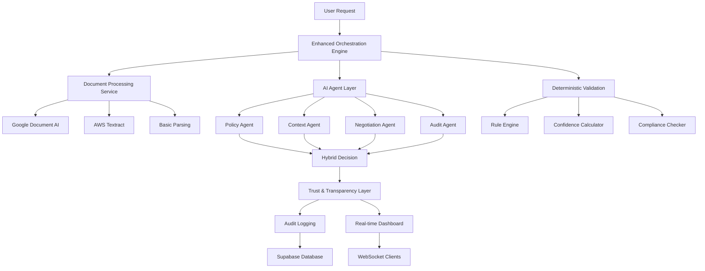

# 🔗 AICOMPLYR.IO Integration Strategy

## **How New Tools Integrate with Existing AI Agents**

### **Current Architecture Analysis** 🏗️

Your existing system has:
- **Multi-agent architecture** (Policy, Context, Negotiation, Audit agents)
- **Enhanced orchestration engine** with workflow management
- **Trust & transparency layer** for audit trails
- **Agency-enterprise bridge** for relationship management
- **Real-time WebSocket** capabilities
- **Enterprise-grade security** with Auth0 + Supabase

### **Integration Philosophy** 🎯

**Hybrid Approach**: Combine AI agents with deterministic tools to address the precision issues from the hackathon article.

**Key Principles**:
1. **AI agents handle interpretation** (creative, contextual analysis)
2. **Deterministic tools handle precision** (document extraction, validation)
3. **Validation layers ensure consistency** (confidence scoring, fallbacks)
4. **Audit trails maintain transparency** (complete decision logging)

---

## **Integration Architecture** 🏛️



---

## **Phase 1: Foundation Integration** 🔧

### **1. Document Processing Integration**

**Current Gap**: No intelligent document processing
**Integration Point**: Enhanced Orchestration Engine

```javascript
// Enhanced Orchestration Engine with Document Processing
class EnhancedOrchestrationEngine {
    async processRequest(request) {
        // Step 1: Document processing (if applicable)
        let documentAnalysis = null;
        if (request.document) {
            documentAnalysis = await documentProcessingService.processDocument(
                request.document,
                request.mimeType,
                { includeAIAnalysis: true }
            );
        }
        
        // Step 2: Route to appropriate agents with document context
        const agentResult = await this.routeToAgent(request, documentAnalysis);
        
        // Step 3: Apply deterministic validation
        const validatedResult = await this.validateResult(agentResult, documentAnalysis);
        
        return validatedResult;
    }
}
```

**Integration Benefits**:
- **Policy Agent** gets structured policy document analysis
- **Audit Agent** gets automated audit report processing
- **Context Agent** gets richer context from document content

### **2. Search Engine Integration**

**Current Gap**: Limited search capabilities
**Integration Point**: All agents for context retrieval

```javascript
// Enhanced Context Agent with Search Integration
class EnhancedContextAgent {
    async process(data) {
        // Step 1: Search for relevant historical context
        const historicalContext = await searchEngineService.search({
            searchTerm: data.userRequest,
            filters: { enterpriseId: data.enterpriseId },
            type: 'policies'
        });
        
        // Step 2: Enhanced context analysis with historical data
        const enhancedContext = await this.analyzeWithHistory(data, historicalContext);
        
        // Step 3: Apply confidence scoring
        const validatedContext = await this.validateContext(enhancedContext);
        
        return validatedContext;
    }
}
```

**Integration Benefits**:
- **Policy Agent** can reference similar historical decisions
- **Audit Agent** can find related compliance violations
- **Negotiation Agent** can access past conflict resolutions

---

## **Phase 2: AI Agent Enhancement** 🤖

### **3. Hybrid Processing Pipeline**

**Current Gap**: Pure AI agents lack deterministic precision
**Integration Point**: Each agent gets validation layer

```javascript
// Enhanced Policy Agent with Hybrid Processing
class EnhancedPolicyAgent {
    async process(data) {
        // Step 1: Deterministic input validation
        const validatedInput = await this.validateInput(data);
        
        // Step 2: AI-powered analysis
        const aiAnalysis = await this.runAIAnalysis(validatedInput);
        
        // Step 3: Deterministic validation of AI result
        const validatedResult = await this.validateAIResult(aiAnalysis);
        
        // Step 4: Confidence scoring and fallback
        const finalResult = await this.calculateFinalResult(validatedResult);
        
        return finalResult;
    }
}
```

**Integration Benefits**:
- **Deterministic validation** catches AI inconsistencies
- **Confidence scoring** determines when human review is needed
- **Fallback mechanisms** ensure system reliability

### **4. Enhanced Audit Integration**

**Current Gap**: Basic audit logging
**Integration Point**: Trust & Transparency Layer

```javascript
// Enhanced Audit Agent with Document Processing
class EnhancedAuditAgent {
    async process(data) {
        // Step 1: Process audit documents
        let documentAnalysis = null;
        if (data.auditReport) {
            documentAnalysis = await documentProcessingService.processDocument(
                data.auditReport,
                'application/pdf',
                { analysisType: 'audit' }
            );
        }
        
        // Step 2: AI-powered audit analysis
        const auditAnalysis = await this.analyzeAudit(data, documentAnalysis);
        
        // Step 3: Generate comprehensive audit trail
        const auditTrail = await this.generateAuditTrail(auditAnalysis);
        
        return auditTrail;
    }
}
```

**Integration Benefits**:
- **Automated audit report processing**
- **AI-powered violation detection**
- **Comprehensive audit trail generation**

---

## **Phase 3: Advanced Features** 🚀

### **5. Regulatory Intelligence Integration**

**Current Gap**: No regulatory monitoring
**Integration Point**: Policy Distribution System

```javascript
// Enhanced Policy Distribution with Regulatory Intelligence
class EnhancedPolicyDistribution {
    async distributePolicy(policy) {
        // Step 1: Check for regulatory updates
        const regulatoryUpdates = await regulatoryIntelligenceService.getUpdates();
        
        // Step 2: Assess policy impact
        const impactAssessment = await this.assessPolicyImpact(policy, regulatoryUpdates);
        
        // Step 3: Distribute with regulatory context
        const distributionResult = await this.distributeWithContext(policy, impactAssessment);
        
        return distributionResult;
    }
}
```

**Integration Benefits**:
- **Automatic regulatory update detection**
- **Policy impact assessment**
- **Compliance gap analysis**

### **6. Advanced Analytics Integration**

**Current Gap**: Limited analytics capabilities
**Integration Point**: Dashboard and Reporting

```javascript
// Enhanced Analytics Service
class EnhancedAnalyticsService {
    async generateInsights() {
        // Step 1: Search for compliance patterns
        const compliancePatterns = await searchEngineService.getComplianceInsights();
        
        // Step 2: AI-powered trend analysis
        const trendAnalysis = await this.analyzeTrends(compliancePatterns);
        
        // Step 3: Generate predictive insights
        const predictiveInsights = await this.generatePredictions(trendAnalysis);
        
        return {
            patterns: compliancePatterns,
            trends: trendAnalysis,
            predictions: predictiveInsights
        };
    }
}
```

**Integration Benefits**:
- **Compliance trend analysis**
- **Risk pattern detection**
- **Predictive compliance insights**

---

## **Integration Implementation Strategy** 🛠️

### **Step 1: Service Layer Integration**

1. **Create Service Interfaces**:
```javascript
// Create api/services/service-interface.js
class ServiceInterface {
    constructor() {
        this.documentProcessing = require('./document-processing');
        this.searchEngine = require('./search-engine');
        this.regulatoryIntelligence = require('./regulatory-intelligence');
        this.analytics = require('./analytics');
    }
}
```

2. **Update Existing Agents**:
```javascript
// Update each agent to use new services
class PolicyAgent {
    constructor() {
        super();
        this.services = new ServiceInterface();
    }
    
    async process(data) {
        // Use new services for enhanced processing
        const documentAnalysis = await this.services.documentProcessing.processDocument(data.document);
        const historicalContext = await this.services.searchEngine.search(data.query);
        
        // Enhanced processing logic
        return await this.processWithServices(data, documentAnalysis, historicalContext);
    }
}
```

### **Step 2: API Layer Integration**

1. **Update API Routes**:
```javascript
// Update server-railway.js
const documentProcessingRoutes = require('./api/routes/document-processing');
const searchRoutes = require('./api/routes/search');
const analyticsRoutes = require('./api/routes/analytics');

app.use('/api/document-processing', documentProcessingRoutes);
app.use('/api/search', searchRoutes);
app.use('/api/analytics', analyticsRoutes);
```

2. **Update Frontend Integration**:
```javascript
// Update frontend to use new APIs
const searchService = {
    search: async (query) => {
        const response = await fetch('/api/search', {
            method: 'POST',
            body: JSON.stringify(query)
        });
        return response.json();
    }
};
```

### **Step 3: Database Integration**

1. **Update Database Schema**:
```sql
-- Add tables for new services
CREATE TABLE document_processing_logs (
    id UUID PRIMARY KEY DEFAULT gen_random_uuid(),
    document_id VARCHAR(255),
    processing_method VARCHAR(100),
    confidence DECIMAL,
    extracted_text TEXT,
    created_at TIMESTAMP DEFAULT NOW()
);

CREATE TABLE search_analytics (
    id UUID PRIMARY KEY DEFAULT gen_random_uuid(),
    query TEXT,
    results_count INTEGER,
    response_time INTEGER,
    user_id UUID,
    created_at TIMESTAMP DEFAULT NOW()
);
```

2. **Update Existing Tables**:
```sql
-- Add columns to existing tables
ALTER TABLE agent_decisions ADD COLUMN confidence DECIMAL;
ALTER TABLE agent_decisions ADD COLUMN processing_method VARCHAR(100);
ALTER TABLE agent_decisions ADD COLUMN validation_passed BOOLEAN;
```

---

## **Integration Testing Strategy** 🧪

### **1. Unit Testing**
```javascript
// Test each service independently
describe('Document Processing Service', () => {
    test('should extract text from PDF', async () => {
        const result = await documentProcessingService.processDocument(pdfBuffer, 'application/pdf');
        expect(result.text).toBeDefined();
        expect(result.confidence).toBeGreaterThan(0.7);
    });
});
```

### **2. Integration Testing**
```javascript
// Test service integration
describe('Enhanced Policy Agent', () => {
    test('should process policy with document analysis', async () => {
        const result = await enhancedPolicyAgent.process({
            tool: 'chatgpt',
            document: pdfBuffer,
            mimeType: 'application/pdf'
        });
        
        expect(result.decision).toBeDefined();
        expect(result.confidence).toBeGreaterThan(0.5);
        expect(result.documentAnalysis).toBeDefined();
    });
});
```

### **3. End-to-End Testing**
```javascript
// Test complete workflow
describe('Complete Workflow', () => {
    test('should process policy request end-to-end', async () => {
        const response = await request(app)
            .post('/api/enhanced-orchestration/process')
            .send({
                tool: 'chatgpt',
                document: pdfBuffer,
                mimeType: 'application/pdf'
            });
        
        expect(response.status).toBe(200);
        expect(response.body.decision).toBeDefined();
    });
});
```

---

## **Migration Strategy** 🔄

### **Phase 1: Parallel Implementation**
- Run new services alongside existing agents
- Gradually route traffic to enhanced agents
- Monitor performance and reliability

### **Phase 2: Gradual Migration**
- Migrate one agent at a time
- A/B test old vs. new implementations
- Roll back if issues arise

### **Phase 3: Full Migration**
- Replace all agents with enhanced versions
- Remove old implementations
- Optimize performance

---

## **Success Metrics** 📊

### **Technical Metrics**
- **Reliability**: 99.9% uptime
- **Performance**: <500ms response time
- **Accuracy**: >95% decision accuracy
- **Confidence**: >85% average confidence

### **Business Metrics**
- **User Satisfaction**: >4.5/5 rating
- **Compliance**: 100% audit compliance
- **Efficiency**: 50% reduction in manual review
- **Cost**: 30% reduction in operational costs

---

## **Risk Mitigation** 🛡️

### **Technical Risks**
- **Service Dependencies**: Implement circuit breakers
- **Data Consistency**: Use transactions and validation
- **Performance**: Monitor and optimize continuously

### **Business Risks**
- **User Adoption**: Provide training and support
- **Compliance**: Maintain audit trails and validation
- **Cost**: Monitor cloud service usage

---

This integration strategy ensures that new tools enhance your existing AI agents while maintaining the reliability and precision needed for enterprise compliance management.