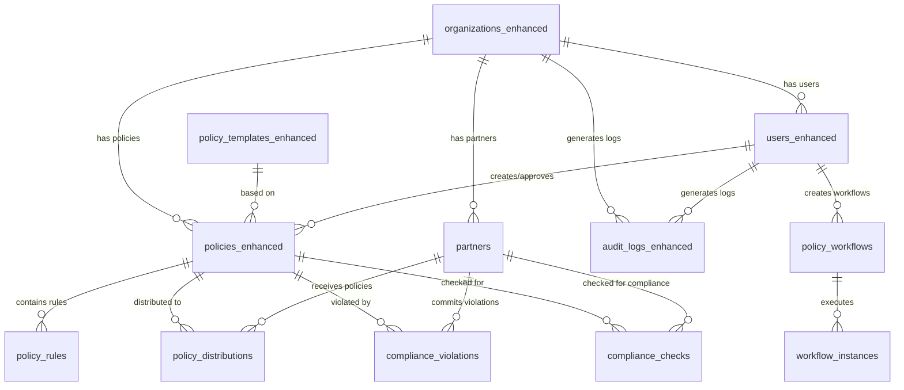

# Policy Management System Database Schema

## Overview

The Policy Management System provides a comprehensive database schema for managing compliance policies, organizations, partners, and audit tracking in pharmaceutical and healthcare industries. The system supports FDA, HIPAA, and AI Act compliance frameworks with extensible rule-based policies.

## Core Tables

### 1. Organizations (`organizations_enhanced`)

Represents pharmaceutical companies and healthcare organizations with compliance requirements.

**Key Fields:**
- `id`: UUID primary key
- `name`: Organization name
- `industry`: Industry type (pharmaceutical, healthcare, financial)
- `compliance_tier`: Enterprise, standard, or basic compliance level
- `contact_email`, `contact_phone`, `address`: Contact information
- `settings`: JSONB for organization-specific settings

**Sample Data:**
```sql
INSERT INTO organizations_enhanced (name, industry, compliance_tier, contact_email) VALUES
('PharmaCorp Inc.', 'pharmaceutical', 'enterprise', 'compliance@pharmacorp.com'),
('MediTech Solutions', 'healthcare', 'standard', 'admin@meditech.com');
```

### 2. Users (`users_enhanced`)

Role-based access control for organization members.

**Key Fields:**
- `id`: UUID primary key
- `organization_id`: References organizations_enhanced
- `email`: Unique email address
- `full_name`: User's full name
- `role`: admin, compliance_officer, partner
- `permissions`: JSONB for granular permissions
- `is_active`: Account status

### 3. Policy Templates (`policy_templates_enhanced`)

Pre-built compliance frameworks that organizations can customize.

**Key Fields:**
- `id`: UUID primary key
- `name`: Template name
- `industry`: Target industry
- `regulation_framework`: FDA, HIPAA, GDPR, AI_ACT
- `template_rules`: JSONB structure for rules
- `risk_categories`: Predefined risk classifications
- `is_public`: Whether template is publicly available

**Sample Templates:**
- FDA Social Media Compliance
- HIPAA Data Protection
- AI Content Disclosure

### 4. Policies (`policies_enhanced`)

Organization-specific policy implementations.

**Key Fields:**
- `id`: UUID primary key
- `organization_id`: References organizations_enhanced
- `template_id`: Optional reference to policy template
- `policy_rules`: Custom rules configuration (JSONB)
- `risk_scoring`: Risk calculation parameters
- `status`: draft, active, archived, suspended
- `created_by`, `approved_by`: User references
- `effective_date`, `expiry_date`: Policy validity period

### 5. Policy Rules (`policy_rules`)

Individual compliance requirements within policies.

**Key Fields:**
- `id`: UUID primary key
- `policy_id`: References policies_enhanced
- `rule_type`: data_handling, content_creation, tool_approval, disclosure
- `rule_name`: Human-readable rule name
- `conditions`: JSONB for when rule applies
- `requirements`: JSONB for what must be satisfied
- `risk_weight`: 1-10 scoring weight
- `enforcement_level`: strict, advisory, warning

## Partner Management

### 6. Partners (`partners`)

Agencies, vendors, and freelancers working with organizations.

**Key Fields:**
- `id`: UUID primary key
- `organization_id`: References organizations_enhanced
- `name`: Partner name
- `partner_type`: agency, vendor, freelancer, consultant
- `services_offered`: Array of services
- `compliance_certifications`: Array of certifications
- `compliance_score`: 0-100 rating
- `risk_level`: low, medium, high, critical

### 7. Policy Distribution (`policy_distributions`)

Tracks policy distribution to partners.

**Key Fields:**
- `id`: UUID primary key
- `policy_id`: References policies_enhanced
- `partner_id`: References partners
- `distributed_at`: When policy was sent
- `acknowledged_at`: When partner acknowledged
- `compliance_status`: pending, compliant, violation, warning
- `compliance_score`: 0-100 score

## Compliance Tracking

### 8. Compliance Violations (`compliance_violations`)

Records policy violations and breaches.

**Key Fields:**
- `id`: UUID primary key
- `organization_id`, `policy_id`, `partner_id`: References
- `violation_type`: policy_breach, data_mishandling, unauthorized_access
- `severity`: low, medium, high, critical
- `description`: Violation details
- `status`: open, investigating, resolved, closed
- `corrective_actions`: Array of actions taken

### 9. Compliance Checks (`compliance_checks`)

Scheduled and manual compliance assessments.

**Key Fields:**
- `id`: UUID primary key
- `organization_id`, `policy_id`, `partner_id`: References
- `check_type`: automated, manual, scheduled
- `status`: passed, failed, warning, pending
- `score`: 0-100 compliance score
- `findings`: JSONB for detailed findings
- `recommendations`: Array of recommendations

### 10. Audit Logs (`audit_logs_enhanced`)

Immutable compliance tracking for all system activities.

**Key Fields:**
- `id`: UUID primary key
- `organization_id`, `user_id`: References
- `action`: policy_created, rule_updated, violation_detected
- `entity_type`: policy, rule, partner, distribution, violation
- `entity_id`: UUID of affected entity
- `details`: JSONB for action-specific metadata
- `risk_level`: low, medium, high, critical

## Workflow Management

### 11. Policy Workflows (`policy_workflows`)

Defines approval and review processes.

**Key Fields:**
- `id`: UUID primary key
- `organization_id`: References organizations_enhanced
- `name`: Workflow name
- `workflow_type`: approval, review, distribution
- `steps`: JSONB workflow configuration
- `status`: active, inactive, draft

### 12. Workflow Instances (`workflow_instances`)

Tracks individual workflow executions.

**Key Fields:**
- `id`: UUID primary key
- `workflow_id`: References policy_workflows
- `entity_type`, `entity_id`: What the workflow is processing
- `current_step`: Current step number
- `status`: active, completed, cancelled, failed

## Database Relationships



## Key Features

### 1. Risk-Based Scoring
- Policies have configurable risk weights
- Compliance scores (0-100) for partners
- Risk levels (low, medium, high, critical) for violations

### 2. Flexible Rule System
- JSONB-based rule conditions and requirements
- Support for complex compliance logic
- Extensible rule types (data_handling, content_creation, etc.)

### 3. Comprehensive Auditing
- Immutable audit logs for all actions
- Detailed metadata tracking
- IP address and user agent logging

### 4. Workflow Support
- Configurable approval processes
- Multi-step workflow instances
- Status tracking and notifications

### 5. Partner Management
- Service and certification tracking
- Compliance score monitoring
- Risk level assessment

## Usage Examples

### Creating a Policy from Template
```sql
-- Get FDA template
SELECT * FROM policy_templates_enhanced 
WHERE regulation_framework = 'FDA' AND industry = 'pharmaceutical';

-- Create custom policy
INSERT INTO policies_enhanced (
    organization_id, name, description, template_id, 
    policy_rules, status, created_by
) VALUES (
    'org-uuid', 'PharmaCorp Social Media Policy',
    'Custom FDA-compliant social media policy',
    'template-uuid',
    '{"data_handling": {"patient_privacy": true}, "content_creation": {"medical_claims": false}}',
    'draft', 'user-uuid'
);
```

### Tracking Policy Distribution
```sql
-- Distribute policy to partner
INSERT INTO policy_distributions (policy_id, partner_id) 
VALUES ('policy-uuid', 'partner-uuid');

-- Update acknowledgment
UPDATE policy_distributions 
SET acknowledged_at = NOW(), acknowledgment_method = 'portal'
WHERE id = 'distribution-uuid';
```

### Compliance Monitoring
```sql
-- Check partner compliance scores
SELECT p.name, p.compliance_score, p.risk_level,
       COUNT(pd.id) as active_policies,
       COUNT(cv.id) as violations
FROM partners p
LEFT JOIN policy_distributions pd ON p.id = pd.partner_id AND pd.compliance_status = 'compliant'
LEFT JOIN compliance_violations cv ON p.id = cv.partner_id AND cv.status = 'open'
WHERE p.organization_id = 'org-uuid'
GROUP BY p.id, p.name, p.compliance_score, p.risk_level;
```

## Migration

To apply this schema:

```bash
# Apply the migration
psql -d your_database -f database/migrations/008_create_policy_management_system.sql

# Rollback if needed
psql -d your_database -f database/migrations/008_create_policy_management_system_down.sql
```

## Performance Considerations

1. **Indexes**: Comprehensive indexing on foreign keys and frequently queried fields
2. **JSONB**: Efficient storage and querying of complex rule structures
3. **Partitioning**: Consider partitioning audit_logs_enhanced by date for large deployments
4. **Archiving**: Implement data archiving for old audit logs and compliance data

## Security Features

1. **Role-based Access**: Granular permissions via JSONB
2. **Audit Trail**: Complete activity logging
3. **Data Integrity**: Foreign key constraints and triggers
4. **Compliance Tracking**: Immutable audit logs

## Future Enhancements

1. **Real-time Notifications**: WebSocket integration for compliance alerts
2. **Machine Learning**: Automated risk assessment and violation detection
3. **API Integration**: RESTful APIs for external system integration
4. **Reporting**: Advanced analytics and compliance reporting
5. **Multi-tenancy**: Enhanced support for multiple organizations
