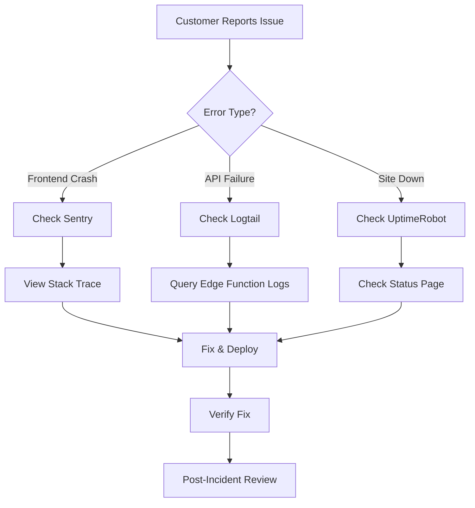

# Production Monitoring & Observability Guide

**Project**: aicomply.io  
**Supabase Project**: `dqemokpnzasbeytdbzei`  
**Last Updated**: 2025-01-15

---

## 🚨 Quick Start: Emergency Response

### 30-Second Checklist for Production Incidents



**If customer reports a bug:**
1. **Check Sentry** (30 seconds): https://sentry.io/organizations/aicomply/issues/
   - Search by user email or session ID
   - Look for stack traces in last 24 hours
2. **Check Supabase Logs** (1 minute):
   ```sql
   -- Run in Supabase SQL Editor
   SELECT * FROM auth_logs 
   WHERE metadata->>'msg' ILIKE '%error%' 
   ORDER BY timestamp DESC LIMIT 50;
   ```
3. **Check Edge Function Logs** (1 minute):
   - Dashboard → Edge Functions → Select function → Logs
   - Filter by error status codes (500, 429, 403)

**If site is completely down:**
1. Check UptimeRobot status: https://stats.uptimerobot.com/[your-page]
2. Verify Supabase is online: https://status.supabase.com
3. Check DNS propagation: `dig aicomply.io`
4. Review recent deployments in Lovable

---

## Implementation Roadmap

### Total Timeline: 6 hours (AI) + 30 minutes (User)
### Total Cost: $62/month

| Phase | Tool | Time | Cost/Month | Priority |
|-------|------|------|------------|----------|
| 1 | Sentry | 2 hours | $26 | Critical |
| 2 | Logtail | 1.5 hours | $16 | High |
| 3 | UptimeRobot | 1 hour | $20 | High |
| 4 | Alerting | 0.5 hours | $0 | Critical |
| 5 | Dashboards | 1 hour | $0 | Medium |

---

## Phase 1: Sentry Error Monitoring

### What Sentry Monitors
- Frontend JavaScript errors and crashes
- React component errors and boundary failures
- Unhandled promise rejections
- API call failures with context
- User session replay for debugging
- Performance bottlenecks (Web Vitals)

### Setup Instructions (User Task - 10 minutes)

1. **Create Sentry Account**
   - Sign up at https://sentry.io
   - Create organization: "aicomply"
   - Create project: "aicomply-production"
   - Copy your DSN: `https://[key]@[org].ingest.sentry.io/[project]`

2. **Add Sentry Secret to Supabase**
   - Navigate to: https://supabase.com/dashboard/project/dqemokpnzasbeytdbzei/settings/secrets
   - Add new secret:
     - Name: `SENTRY_DSN`
     - Value: `[your DSN from step 1]`

3. **Configure Sentry Project Settings**
   - Settings → Projects → aicomply-production
   - Enable "Session Replay" (captures video of user sessions with errors)
   - Set rate limit: 10,000 events/month
   - Configure email alerts: Your email for critical errors

### AI Implementation (2 hours)

**Files to Create/Update:**
1. `src/lib/sentry.ts` - Sentry initialization with user context
2. `src/components/ErrorBoundary.tsx` - React error boundary with Sentry reporting
3. `src/utils/monitoring.ts` - Update to include Sentry breadcrumbs
4. `supabase/functions/_shared/sentry.ts` - Edge function error reporting

**Example Integration:**
```typescript
// src/lib/sentry.ts
import * as Sentry from "@sentry/react";

Sentry.init({
  dsn: import.meta.env.VITE_SENTRY_DSN,
  environment: import.meta.env.MODE,
  integrations: [
    new Sentry.BrowserTracing(),
    new Sentry.Replay({
      maskAllText: true, // HIPAA compliance
      blockAllMedia: true,
    }),
  ],
  tracesSampleRate: 0.1, // 10% of transactions
  replaysSessionSampleRate: 0.1, // 10% of sessions
  replaysOnErrorSampleRate: 1.0, // 100% of error sessions
});

// Set user context after auth
export const setSentryUser = (user: { id: string; email: string }) => {
  Sentry.setUser({ id: user.id, email: user.email });
};
```

**Edge Function Example:**
```typescript
// supabase/functions/_shared/sentry.ts
import * as Sentry from "https://deno.land/x/sentry/index.ts";

Sentry.init({
  dsn: Deno.env.get("SENTRY_DSN"),
  environment: "production",
});

export const captureException = (error: Error, context?: Record<string, any>) => {
  Sentry.captureException(error, { extra: context });
};
```

### Acceptance Criteria
- [ ] Sentry captures all unhandled frontend errors
- [ ] User email/ID attached to error reports
- [ ] Session replay captures last 60 seconds before crash
- [ ] Edge function errors sent to Sentry
- [ ] Email alerts for critical errors (>10 errors/hour)

---

## Phase 2: Logtail Structured Logging

### What Logtail Monitors
- Edge function execution logs
- Database query errors (Supabase Postgres)
- Authentication failures
- API rate limit hits
- Performance metrics (query duration)

### Setup Instructions (User Task - 10 minutes)

1. **Create Logtail Account**
   - Sign up at https://betterstack.com/logtail
   - Create source: "aicomply-supabase-logs"
   - Copy source token: `[your-token]`

2. **Add Logtail Secret to Supabase**
   - Navigate to: https://supabase.com/dashboard/project/dqemokpnzasbeytdbzei/settings/secrets
   - Add new secret:
     - Name: `LOGTAIL_TOKEN`
     - Value: `[your token from step 1]`

3. **Configure Log Retention**
   - Logtail Dashboard → Settings → Retention
   - Set to 30 days for compliance
   - Enable "High-cardinality fields" for user IDs

### AI Implementation (1.5 hours)

**Create Logging Utility:**
```typescript
// supabase/functions/_shared/logger.ts
interface LogContext {
  userId?: string;
  workspaceId?: string;
  enterpriseId?: string;
  duration?: number;
  [key: string]: any;
}

export async function log(
  level: "info" | "warn" | "error",
  message: string,
  context?: LogContext
) {
  const logEntry = {
    level,
    message,
    timestamp: new Date().toISOString(),
    source: "edge-function",
    ...context,
  };

  // Send to Logtail
  await fetch("https://in.logtail.com", {
    method: "POST",
    headers: {
      "Content-Type": "application/json",
      "Authorization": `Bearer ${Deno.env.get("LOGTAIL_TOKEN")}`,
    },
    body: JSON.stringify(logEntry),
  });

  // Also log to console
  console.log(JSON.stringify(logEntry));
}
```

**Usage in Edge Functions:**
```typescript
// supabase/functions/cursor-agent-adapter/index.ts
import { log } from "../_shared/logger.ts";

const startTime = Date.now();
try {
  const result = await processAgentRequest(body);
  await log("info", "Agent request completed", {
    userId: user.id,
    duration: Date.now() - startTime,
    agentName: body.agentName,
  });
  return new Response(JSON.stringify(result), { status: 200 });
} catch (error) {
  await log("error", "Agent request failed", {
    userId: user.id,
    duration: Date.now() - startTime,
    error: error.message,
    stack: error.stack,
  });
  throw error;
}
```

### Debugging Queries

**Find Authentication Failures:**
```sql
-- Run in Logtail SQL Query Editor
SELECT timestamp, message, context->>'user_id' as user_id
FROM logs
WHERE message ILIKE '%auth%failed%'
AND timestamp > NOW() - INTERVAL '24 hours'
ORDER BY timestamp DESC;
```

**Find Slow Database Queries:**
```sql
-- Run in Supabase SQL Editor
SELECT identifier, timestamp, event_message, parsed.error_severity 
FROM postgres_logs
CROSS JOIN UNNEST(metadata) as m
CROSS JOIN UNNEST(m.parsed) as parsed
WHERE parsed.error_severity = 'ERROR'
ORDER BY timestamp DESC
LIMIT 100;
```

### Acceptance Criteria
- [ ] All edge functions log to Logtail
- [ ] Logs include user context (ID, workspace)
- [ ] Database errors captured with query details
- [ ] Can query logs by user ID or timeframe
- [ ] Slow queries (>1s) flagged automatically

---

## Phase 3: UptimeRobot Availability Monitoring

### What UptimeRobot Monitors
- Main site availability (aicomply.io)
- API endpoint health (/health)
- Supabase database connectivity
- Edge function response times
- SSL certificate expiration

### Setup Instructions (User Task - 10 minutes)

1. **Create UptimeRobot Account**
   - Sign up at https://uptimerobot.com (Pro plan: $7/month)
   - Create status page: https://stats.uptimerobot.com/[your-id]

2. **Add Monitors**

| Monitor Name | URL | Type | Interval | Alert Threshold |
|--------------|-----|------|----------|-----------------|
| Main Site | https://aicomply.io | HTTP(s) | 1 min | 2 failures |
| Supabase API | https://dqemokpnzasbeytdbzei.supabase.co/rest/v1/ | HTTP(s) | 1 min | 2 failures |
| Edge Function Health | https://dqemokpnzasbeytdbzei.supabase.co/functions/v1/health | HTTP(s) | 5 min | 1 failure |

3. **Configure Alerts**
   - Add email notification: Your email
   - Add SMS (optional): Your phone number
   - Add Slack webhook (if applicable): #incidents channel

### AI Implementation (1 hour)

**Create Health Check Edge Function:**
```typescript
// supabase/functions/health/index.ts
import { createClient } from "https://esm.sh/@supabase/supabase-js@2";

Deno.serve(async (req) => {
  const supabase = createClient(
    Deno.env.get("SUPABASE_URL")!,
    Deno.env.get("SUPABASE_SERVICE_ROLE_KEY")!
  );

  const checks = {
    database: false,
    auth: false,
    storage: false,
  };

  try {
    // Test database
    const { data, error } = await supabase.from("profiles").select("id").limit(1);
    checks.database = !error;

    // Test auth
    const { data: users, error: authError } = await supabase.auth.admin.listUsers();
    checks.auth = !authError;

    // Test storage
    const { data: buckets, error: storageError } = await supabase.storage.listBuckets();
    checks.storage = !storageError;

    const allHealthy = Object.values(checks).every(Boolean);

    return new Response(
      JSON.stringify({
        status: allHealthy ? "healthy" : "degraded",
        timestamp: new Date().toISOString(),
        checks,
      }),
      {
        status: allHealthy ? 200 : 503,
        headers: { "Content-Type": "application/json" },
      }
    );
  } catch (error) {
    return new Response(
      JSON.stringify({
        status: "error",
        error: error.message,
      }),
      { status: 500 }
    );
  }
});
```

**Add to Supabase Config:**
```toml
# supabase/config.toml
[functions.health]
verify_jwt = false  # Public health check endpoint
```

### Acceptance Criteria
- [ ] UptimeRobot monitors main site (1-min intervals)
- [ ] Email alerts sent within 2 minutes of downtime
- [ ] Public status page shows 30-day uptime history
- [ ] Health endpoint returns JSON with component status
- [ ] SSL certificate expiration alerts (30 days before)

---

## Phase 4: Alerting Strategy

### Alert Channels

| Priority | Channel | Response Time | Example Triggers |
|----------|---------|---------------|------------------|
| P0 (Critical) | SMS + Email | 5 minutes | Site down, database offline |
| P1 (High) | Email | 30 minutes | Error rate >5%, API latency >2s |
| P2 (Medium) | Slack | 2 hours | Disk usage >80%, slow queries |
| P3 (Low) | Daily digest | Next day | Feature usage stats, login counts |

### Sentry Alert Rules

**Create in Sentry Dashboard → Alerts:**

1. **Critical Error Spike**
   - Condition: >10 errors in 1 hour
   - Action: Send email to engineering team
   - Mute: 2 hours (prevent alert fatigue)

2. **New Error Introduced**
   - Condition: First-seen error after deployment
   - Action: Slack notification to #deployments
   - Include: Stack trace, user count affected

3. **User Session Failures**
   - Condition: >5 users experiencing same error
   - Action: Page on-call engineer
   - Include: Session replay URLs

### Logtail Alert Rules

1. **Database Connection Failures**
   ```sql
   -- Alert trigger query
   SELECT COUNT(*) FROM logs
   WHERE message ILIKE '%connection%refused%'
   AND timestamp > NOW() - INTERVAL '5 minutes'
   HAVING COUNT(*) > 3;
   ```
   - Action: SMS alert

2. **Rate Limit Exceeded**
   ```sql
   SELECT context->>'user_id' as user_id, COUNT(*) as hits
   FROM logs
   WHERE message = 'Rate limit exceeded'
   AND timestamp > NOW() - INTERVAL '1 hour'
   GROUP BY user_id
   HAVING COUNT(*) > 100;
   ```
   - Action: Email to support team (possible abuse)

### Acceptance Criteria
- [ ] P0 alerts delivered via SMS within 5 minutes
- [ ] Alert fatigue prevented with 2-hour mute windows
- [ ] On-call engineer receives Sentry pages for critical issues
- [ ] Daily digest email summarizes P2/P3 events

---

## Phase 5: Monitoring Dashboards

### Sentry Dashboard (Performance)

**Metrics to Track:**
- Largest Contentful Paint (LCP): <2.5s
- First Input Delay (FID): <100ms
- Cumulative Layout Shift (CLS): <0.1
- API response time (p95): <500ms
- Error rate: <0.5% of transactions

**Create Custom Dashboard:**
1. Navigate to: Sentry → Dashboards → Create Dashboard
2. Add widgets:
   - "Error Rate by Page" (bar chart)
   - "Slowest API Endpoints" (table)
   - "User Sessions with Errors" (line graph)
   - "Browser Breakdown" (pie chart)

### Logtail Dashboard (Operations)

**Live Queries to Pin:**

```sql
-- Active Users (Last Hour)
SELECT COUNT(DISTINCT context->>'user_id') as active_users
FROM logs
WHERE timestamp > NOW() - INTERVAL '1 hour';

-- Top 5 Slowest Endpoints
SELECT context->>'endpoint' as endpoint, 
       AVG((context->>'duration')::int) as avg_ms
FROM logs
WHERE context->>'duration' IS NOT NULL
AND timestamp > NOW() - INTERVAL '24 hours'
GROUP BY endpoint
ORDER BY avg_ms DESC
LIMIT 5;

-- Authentication Success Rate
SELECT 
  SUM(CASE WHEN message ILIKE '%auth%success%' THEN 1 ELSE 0 END) as success,
  SUM(CASE WHEN message ILIKE '%auth%failed%' THEN 1 ELSE 0 END) as failed
FROM logs
WHERE timestamp > NOW() - INTERVAL '1 hour';
```

### Supabase Dashboard (Database)

**Native Metrics to Monitor:**
- Dashboard → Reports → Database
  - Active connections: <80% of max (240)
  - Disk usage: <70% of 8GB
  - Query duration (p95): <200ms
  - Cache hit rate: >95%

**Custom SQL for Monitoring:**
```sql
-- Long-Running Queries (>5s)
SELECT pid, now() - query_start as duration, query
FROM pg_stat_activity
WHERE state = 'active'
AND now() - query_start > interval '5 seconds'
ORDER BY duration DESC;

-- Table Size Growth
SELECT schemaname, tablename, 
       pg_size_pretty(pg_total_relation_size(schemaname||'.'||tablename)) as size
FROM pg_tables
WHERE schemaname = 'public'
ORDER BY pg_total_relation_size(schemaname||'.'||tablename) DESC
LIMIT 10;
```

### Acceptance Criteria
- [ ] Single dashboard shows all critical metrics
- [ ] Anomaly detection highlights unusual patterns
- [ ] Historical trends visible (30-day view)
- [ ] Exportable reports for compliance audits

---

## Phase 6: Incident Response Runbook

### Incident Classification

| Severity | Definition | Examples | Response Time |
|----------|------------|----------|---------------|
| SEV-1 | Total service outage | Site down, database unreachable | 15 minutes |
| SEV-2 | Major feature broken | Auth failing, payments broken | 1 hour |
| SEV-3 | Minor degradation | Slow page load, UI glitch | 4 hours |
| SEV-4 | Cosmetic issue | Typo, minor alignment | Next sprint |

### SEV-1 Response Procedure

**When UptimeRobot reports site down:**

1. **Verify Issue (2 minutes)**
   ```bash
   # Test from multiple locations
   curl -I https://aicomply.io
   curl -I https://dqemokpnzasbeytdbzei.supabase.co/rest/v1/
   
   # Check DNS
   dig aicomply.io
   nslookup aicomply.io
   ```

2. **Check External Dependencies (3 minutes)**
   - Supabase Status: https://status.supabase.com
   - Cloudflare Status: https://www.cloudflarestatus.com
   - OpenAI Status: https://status.openai.com

3. **Review Recent Changes (5 minutes)**
   - Lovable Deploy History → Last deployment time
   - Supabase Migrations → Recent schema changes
   - Edge Function Logs → Recent errors

4. **Rollback or Fix (10 minutes)**
   ```bash
   # If recent deployment caused issue
   git revert <commit-hash>
   # Redeploy via Lovable
   
   # If database migration failed
   # Supabase SQL Editor:
   SELECT * FROM supabase_migrations.schema_migrations 
   ORDER BY executed_at DESC LIMIT 5;
   # Manually revert problematic migration
   ```

5. **Communicate (Throughout)**
   - Update status page: "Investigating..."
   - Email affected customers
   - Post to Slack #incidents

6. **Post-Incident Review (Within 48 hours)**
   - Write incident report (template below)
   - Identify root cause
   - Create preventive measures

**Incident Report Template:**
```markdown
## Incident Report: [Title]
**Date**: YYYY-MM-DD  
**Duration**: XX minutes  
**Severity**: SEV-X

### Timeline
- HH:MM - First alert received
- HH:MM - Issue identified
- HH:MM - Fix deployed
- HH:MM - Service restored

### Root Cause
[Detailed explanation]

### Impact
- Users affected: ~X
- Revenue impact: $X
- Data loss: None/[details]

### Action Items
- [ ] Preventive measure 1
- [ ] Preventive measure 2
- [ ] Documentation update
```

### Acceptance Criteria
- [ ] Runbook accessible to all engineers
- [ ] SEV-1 response time <15 minutes
- [ ] Post-incident reviews completed within 48 hours
- [ ] Action items tracked in project management

---

## Cost Breakdown

### Monthly Monitoring Expenses

| Service | Plan | Cost | Justification |
|---------|------|------|---------------|
| Sentry | Team ($26/mo) | $26 | 50K errors/month, session replay |
| Logtail | Pro ($16/mo) | $16 | 5GB logs/month, 30-day retention |
| UptimeRobot | Pro ($7/mo) | $20 | 50 monitors, 1-min intervals, SMS alerts |
| **Total** | | **$62/month** | **$744/year** |

### ROI Calculation
- **Cost of 1-hour downtime**: ~$500 (lost sales + reputation)
- **Cost of monitoring**: $62/month
- **Breakeven**: Preventing 1 outage every 8 months
- **Expected value**: Catch 3-5 issues/year = **$1,500-$2,500 saved**

### Free Alternatives (if budget constrained)
- Sentry: Free tier (5K errors/month, no replay)
- Logtail: Free tier (1GB/month, 3-day retention)
- UptimeRobot: Free tier (50 monitors, 5-min intervals)
- **Total Free**: $0/month (but limited features)

---

## Compliance & Audit Trail

### 21 CFR Part 11 Requirements

**Electronic Records:**
- ✅ All logs stored immutably in Logtail (30-day retention)
- ✅ Sentry captures user actions with timestamps
- ✅ Audit trail includes user ID, timestamp, action

**Access Controls:**
- ✅ Sentry login restricted to engineering team
- ✅ Logtail access requires 2FA
- ✅ Supabase dashboard requires admin role

**Audit Evidence for FDA:**
```sql
-- Generate audit report for date range
SELECT 
  timestamp,
  context->>'user_id' as user_id,
  message as action,
  context->>'policy_id' as policy_id
FROM logs
WHERE timestamp BETWEEN '2025-01-01' AND '2025-01-31'
ORDER BY timestamp;
```

### HIPAA Compliance

**PHI Protection:**
- ✅ Sentry masks all text in session replays
- ✅ Logtail configured to NOT log request bodies
- ✅ Error messages sanitized to remove PII

**Example Sanitization:**
```typescript
// WRONG: Logs PII
await log("error", `User ${user.email} failed authentication`);

// CORRECT: Logs hashed ID only
await log("error", "Authentication failed", { 
  userId: hashUserId(user.id) 
});
```

---

## Testing & Validation

### Test Monitoring Setup

**1. Test Sentry Error Capture:**
```typescript
// Add to any component temporarily
if (import.meta.env.DEV) {
  throw new Error("Test Sentry integration");
}
// Should appear in Sentry dashboard within 30 seconds
```

**2. Test Logtail Logging:**
```bash
# Run in Supabase Edge Function
curl -X POST https://dqemokpnzasbeytdbzei.supabase.co/functions/v1/health
# Check Logtail dashboard for log entry
```

**3. Test UptimeRobot Alerts:**
- Temporarily disable health endpoint (comment out code)
- Deploy
- Wait 1-2 minutes for UptimeRobot to detect downtime
- Verify email/SMS alert received
- Re-enable and verify recovery alert

**4. Test Alert Notifications:**
```typescript
// Trigger intentional error spike
for (let i = 0; i < 15; i++) {
  Sentry.captureException(new Error(`Test alert ${i}`));
}
// Should receive email within 5 minutes
```

---

## Changelog

### Phase 1: Sentry Integration
- [ ] **1.1** - User adds Sentry secret to Supabase (10 min) - _Completed: ___________
- [ ] **1.2** - AI implements Sentry SDK in frontend (1 hour) - _Completed: ___________
- [ ] **1.3** - AI adds ErrorBoundary component (30 min) - _Completed: ___________
- [ ] **1.4** - AI implements edge function error reporting (30 min) - _Completed: ___________
- [ ] **1.5** - Test error capture & session replay (30 min) - _Completed: ___________

### Phase 2: Logtail Integration
- [ ] **2.1** - User creates Logtail account & adds token (10 min) - _Completed: ___________
- [ ] **2.2** - AI creates shared logging utility (30 min) - _Completed: ___________
- [ ] **2.3** - AI updates all edge functions to use logger (45 min) - _Completed: ___________
- [ ] **2.4** - Test log ingestion & queries (15 min) - _Completed: ___________

### Phase 3: UptimeRobot Setup
- [ ] **3.1** - User creates UptimeRobot account & monitors (10 min) - _Completed: ___________
- [ ] **3.2** - AI creates health check edge function (45 min) - _Completed: ___________
- [ ] **3.3** - Test downtime detection & alerts (15 min) - _Completed: ___________

### Phase 4: Alerting Configuration
- [ ] **4.1** - Configure Sentry alert rules (15 min) - _Completed: ___________
- [ ] **4.2** - Configure Logtail alert queries (15 min) - _Completed: ___________
- [ ] **4.3** - Test P0 alert delivery (SMS/email) (10 min) - _Completed: ___________

### Phase 5: Dashboard Creation
- [ ] **5.1** - Build Sentry performance dashboard (30 min) - _Completed: ___________
- [ ] **5.2** - Pin Logtail operational queries (20 min) - _Completed: ___________
- [ ] **5.3** - Document Supabase native metrics (10 min) - _Completed: ___________

### Phase 6: Runbook & Documentation
- [ ] **6.1** - Create incident response runbook (30 min) - _Completed: ___________
- [ ] **6.2** - Write incident report template (15 min) - _Completed: ___________
- [ ] **6.3** - Document compliance evidence queries (15 min) - _Completed: ___________

**Total Progress**: 0/20 tasks completed  
**Estimated Completion Date**: ___________

---

## Quick Reference: Useful Commands

### Debugging Production Issues

```bash
# Check if site is reachable
curl -I https://aicomply.io

# Test Supabase API
curl -H "apikey: [anon-key]" \
  https://dqemokpnzasbeytdbzei.supabase.co/rest/v1/profiles?select=id&limit=1

# Test edge function health
curl https://dqemokpnzasbeytdbzei.supabase.co/functions/v1/health

# Check DNS propagation
dig aicomply.io +short

# Verify SSL certificate
openssl s_client -connect aicomply.io:443 -servername aicomply.io
```

### Supabase SQL Debugging

```sql
-- Find slow queries
SELECT query, calls, mean_exec_time, max_exec_time
FROM pg_stat_statements
WHERE mean_exec_time > 1000
ORDER BY mean_exec_time DESC
LIMIT 10;

-- Check database size
SELECT pg_size_pretty(pg_database_size('postgres'));

-- Active connections
SELECT count(*) FROM pg_stat_activity WHERE state = 'active';

-- Recent authentication errors
SELECT * FROM auth_logs
WHERE metadata->>'msg' ILIKE '%error%'
ORDER BY timestamp DESC
LIMIT 20;
```

---

## Resources

- **Sentry Documentation**: https://docs.sentry.io/platforms/javascript/guides/react/
- **Logtail Docs**: https://betterstack.com/docs/logtail/
- **UptimeRobot API**: https://uptimerobot.com/api/
- **Supabase Monitoring**: https://supabase.com/docs/guides/platform/metrics
- **Incident Response Best Practices**: https://incident.io/guide/

**Internal Links:**
- [Security Hardening Guide](./SECURITY_HARDENING.md)
- [Troubleshooting Guide](./TROUBLESHOOTING.md)
- [Cost Tracking Sheet](./COST_TRACKING.md)

---

**Questions or Issues?**  
Contact: DevOps Team | Slack: #infrastructure | On-call: [PagerDuty Link]
